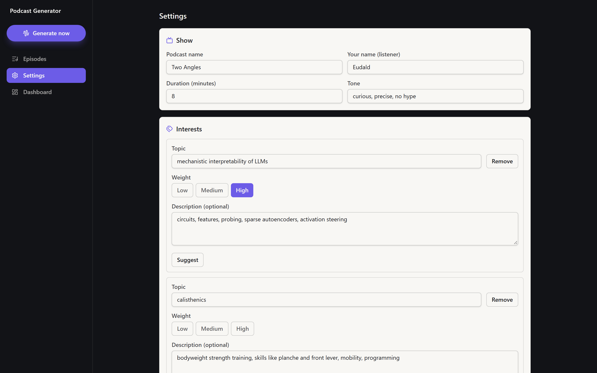
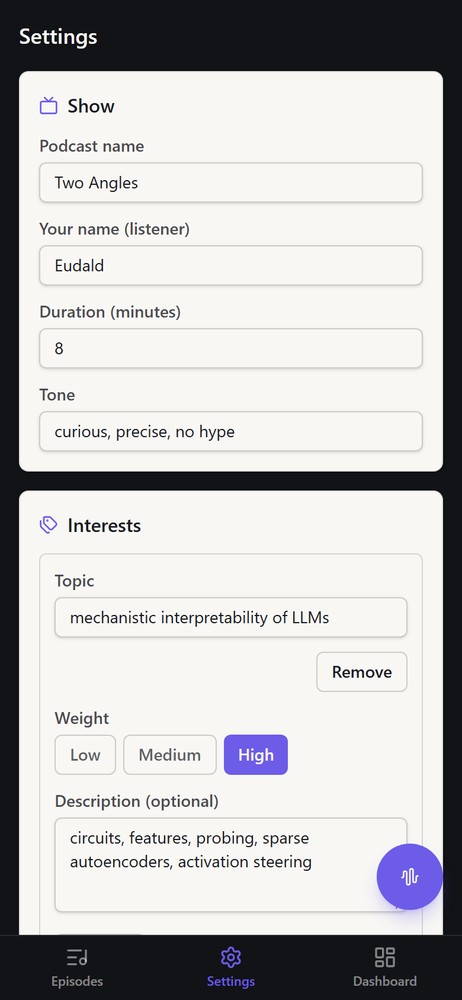
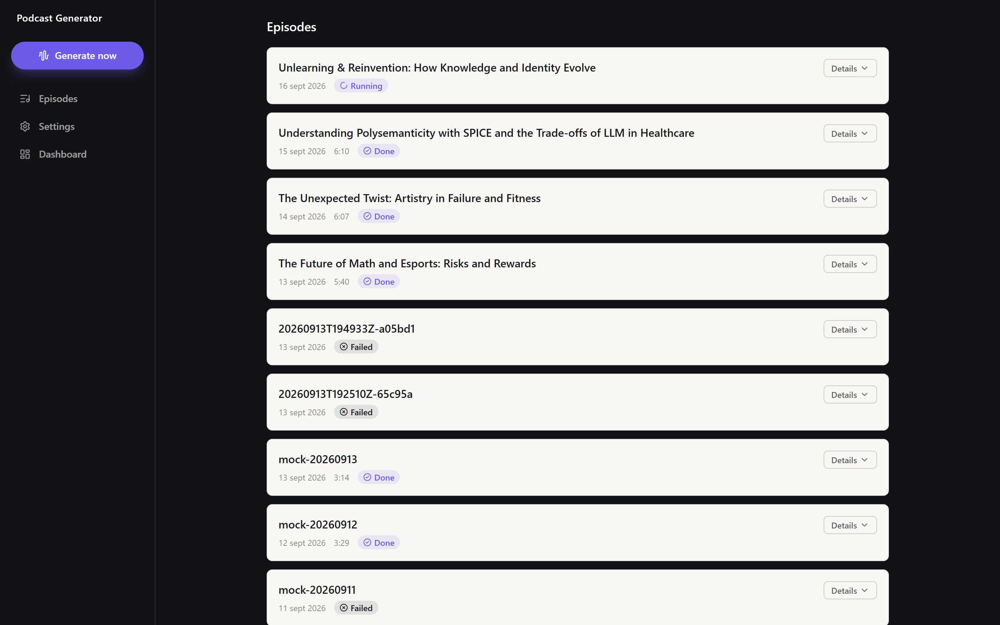
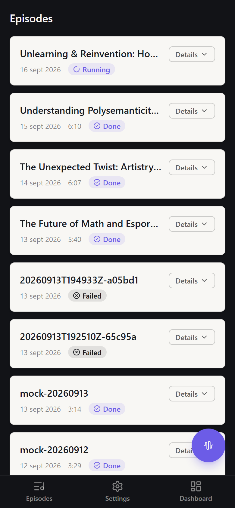
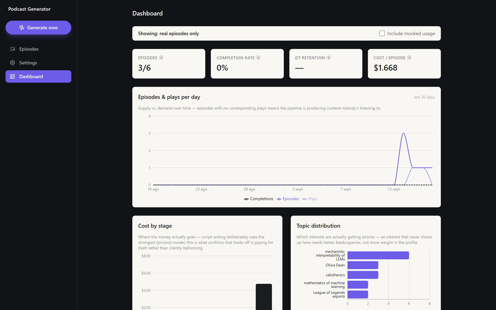
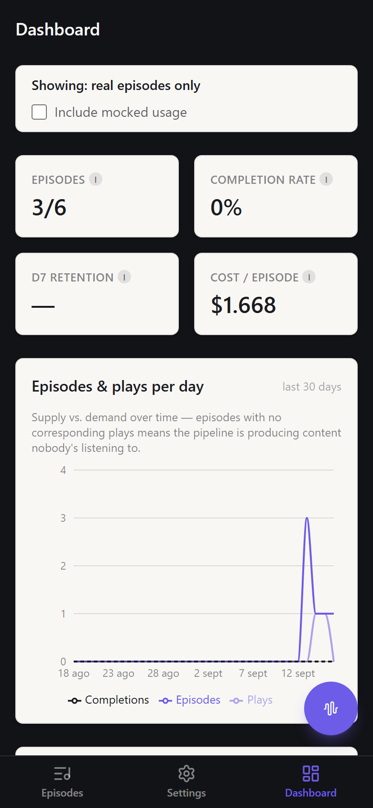

# Personal Podcast Generator

Given a profile of your interests, this app fetches recent news, papers, and (when nothing fresh
exists) grounded background reading, then writes and performs a two-host podcast script and
synthesizes it into an mp3 with ElevenLabs. It's a full pipeline (fetch → rank → outline → script
→ critique → perform → tts → stitch) behind a FastAPI backend with a scheduler, a settings UI to
edit your profile, and a metrics dashboard — not just a one-shot script. See
[`solution.md`](solution.md) for the design write-up and [`docs/decisions.md`](docs/decisions.md)
for the full decision log.

## Screenshots

Desktop (1440×900) and mobile (390×844) — see [`docs/ui.md`](docs/ui.md#design) for the design
pass these come from (palette, navigation, cards, the transcript view, etc).

**Settings** — edit interests (Low/Medium/High weight), hosts, style, and schedule; one section
icon per card.

| Desktop | Mobile |
|---|---|
|  |  |

**Episodes** — episode cards with the script's own title, date, duration, status, and a labelled
Details toggle; "Generate now" is always visible in the app shell.

| Desktop | Mobile |
|---|---|
|  |  |

**Dashboard** — cost, completion rate, retention, and per-stage breakdown, with a toggle for
whether mocked demo data is included.

| Desktop | Mobile |
|---|---|
|  |  |

## Quickstart (Docker)

```bash
cp .env.example .env
# then edit .env and fill in OPENAI_API_KEY / ELEVENLABS_API_KEY

docker compose up
```

Open [http://localhost:8000](http://localhost:8000) for the UI, and
[http://localhost:8000/docs](http://localhost:8000/docs) for the interactive API docs. Episode
data (the sqlite DB and every episode's artefacts/audio) persists in the `podcast-data` named
volume across restarts and rebuilds.

## Quickstart (without Docker)

Requires [uv](https://docs.astral.sh/uv/), Node 22+, and `ffmpeg` on your `PATH` (pydub shells out
to it).

```bash
cp .env.example .env
# then edit .env and fill in OPENAI_API_KEY / ELEVENLABS_API_KEY

uv sync
cd web && npm install && npm run build && cd ..
uv run podcast serve
```

Open [http://localhost:8000](http://localhost:8000). For frontend iteration with hot reload
instead of a static build, run the backend and the Vite dev server separately in two terminals
(Vite proxies API calls to `:8000` — see `docs/ui.md`):

```bash
uv run podcast serve            # terminal 1 — backend on :8000
cd web && npm install && npm run dev   # terminal 2 — UI on :5173 (or the next free port)
```

## Generating an episode

**From the UI**: go to `/episodes` and click **Generate now**. The list polls every 3s while
anything is `pending`/`running`; expand a row once it's `done` for the audio player, show notes,
and full script.

**From the CLI**:

```bash
uv run python -m podcast.generate --profile profiles/eudald.yaml
uv run pytest
```

The CLI also supports resuming from any persisted stage artefact (`--from-articles`,
`--from-ranked`, `--from-outline`, `--from-script`, `--from-critique`, `--from-performance`) and
stopping early (`--until <stage>`) — see `uv run python -m podcast.generate --help`.

## Seeding the dashboard

`/dashboard` is empty until episodes exist. To see it populated without spending on real API
calls, seed mocked-but-plausible usage data:

```bash
uv run podcast seed-metrics
```

Real episodes and mocked data are kept structurally separate (mocked rows are flagged and never
land on today's date) — see `docs/decisions.md` ("Dashboard metrics").

## Sample audio

[`sample.mp3`](sample.mp3), at the repo root, is a real generated episode (not a synthetic demo)
— open it directly to hear the output.

## Further reading

- [`solution.md`](solution.md) — the solution write-up: architecture, key trade-offs, what's out
  of scope.
- [`docs/decisions.md`](docs/decisions.md) — the full, dated decision log this project was built
  against.
- [`docs/ui.md`](docs/ui.md) — the frontend's routes and state flow.
- [`CLAUDE.md`](CLAUDE.md) — the architecture rules and working conventions this codebase follows.
